## Coder Academy Term 1 Assignment 2 - Portfolio Website by Joshua Phillips

***

### [Portfolio Website](https://josh-phillips-portfolio.vercel.app/)
### [Git Hub Repository](https://github.com/jophc1/JoshuaPhillips_T1A2)
### [Slide Presentation Youtube](needs link here)

***

### Purpose
This portfolio website was created with the intent to not only be a learning tool to improve my skillset, but also to showcase my design style to everyone and help inspire others.

***

### Target Audience
My portfolio is intended to be for potential employers and customers, but can also be viewed by anyone that may have a interest in any projects I've been involved in or even to use my portfolio as a design reference for their own. 

***

### Functionality and features
As a large majority of people use a mobile device to access a website, the main goal was to create a robust mobile view for my website and then change properties for larger screen sizes. This helps reduce the workload and time with the implementation of the HTML and CSS across my portfolio webpages.

My webpages were created with a basic colour scheme to prevent the user from being overwhelmed, and apart for the text used for the navigation links and page title, the text was selected to emphasize on readability rather than style.  

The porfolio contains four main sections:
* Home: This is the default webpage for the portfolio and has a basic self portrait and welcome text.
* About me: Contains more personal information about me, including hobbies, interests and programming skills.
* Blogs: Has links to five different blog posts which contain a brief summary of what the blog is about.
* Contact: Has interactive icons that guides the user to social media and professional accounts. This also contains a pdf of my Resume.

***

### Sitemap
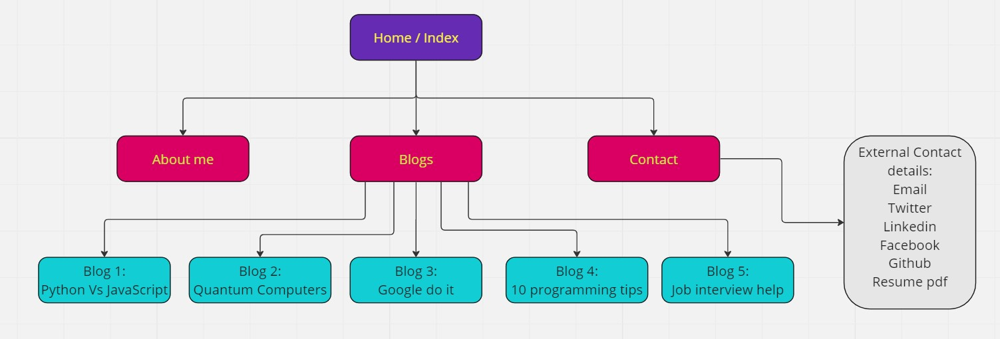

***

### Wireframes and Screenshots

#### Index / Home Wireframes
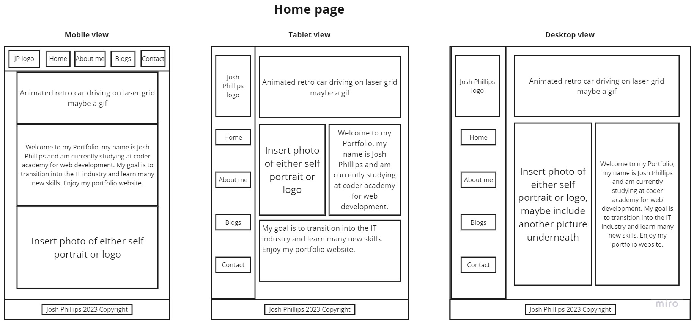

#### Index / Home Screenshots
##### Mobile View

##### Tablet View
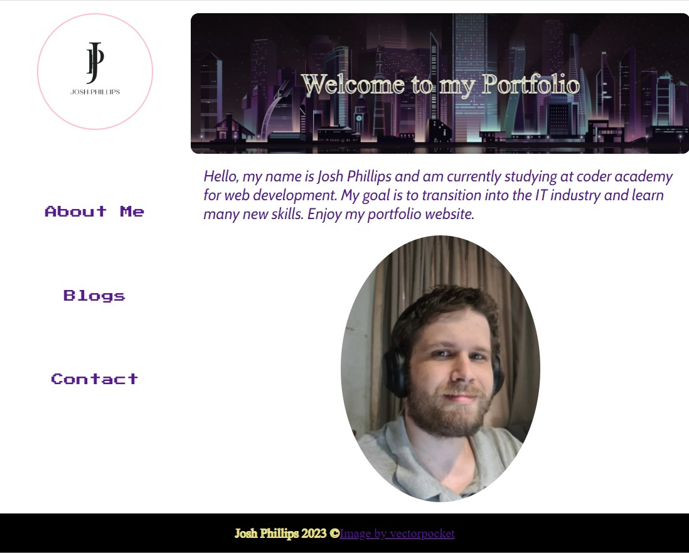

##### Desktop View
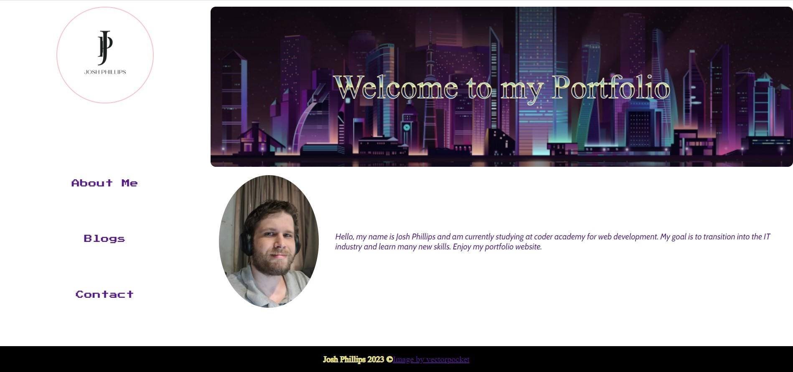

#### About me Wireframes
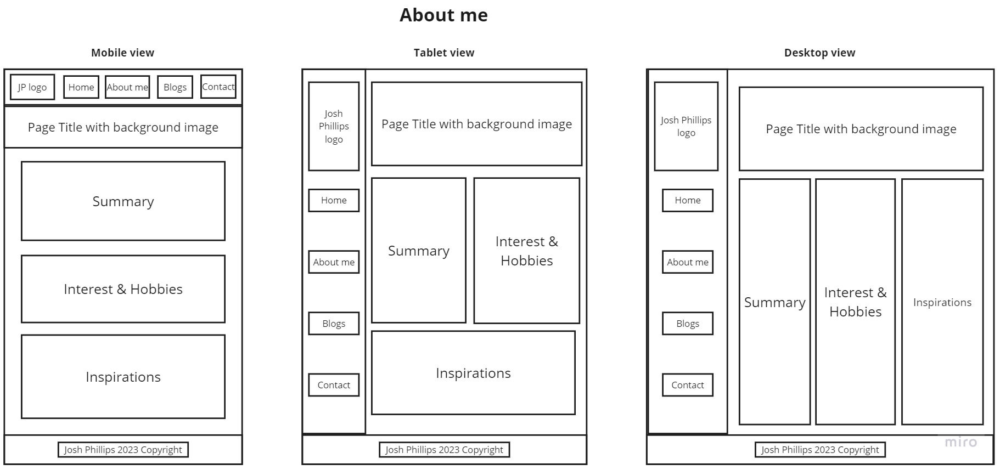

#### About me Screenshots
##### Mobile View
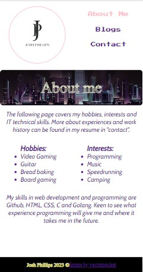

##### Tablet View
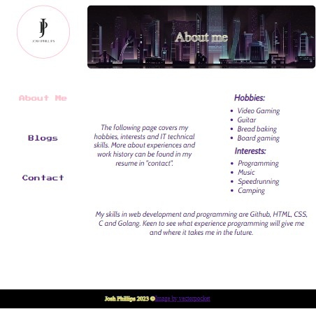

##### Desktop View
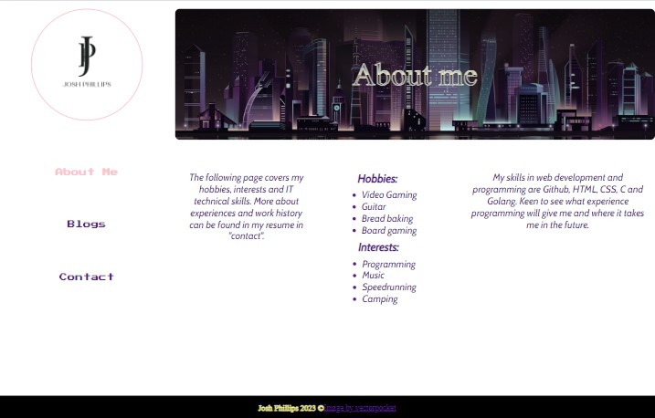

#### Blogs List Wireframes 
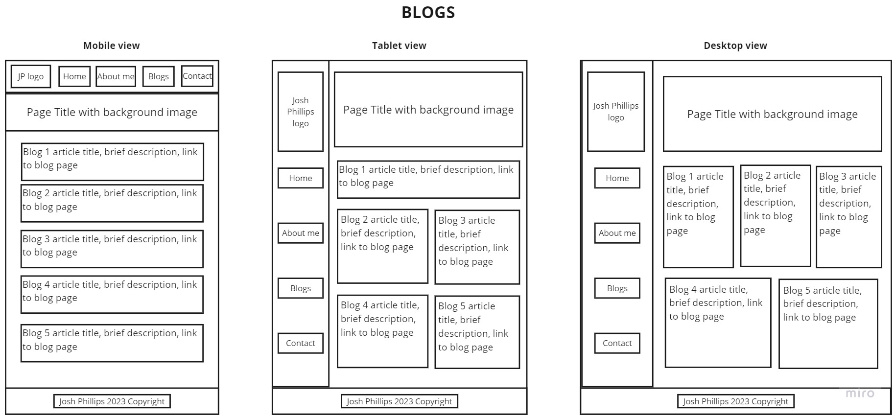

#### Blogs List Screenshots
##### Mobile View
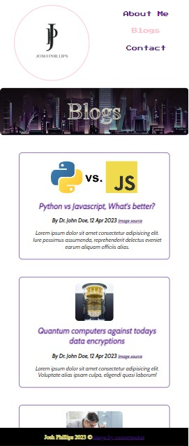

##### Tablet View
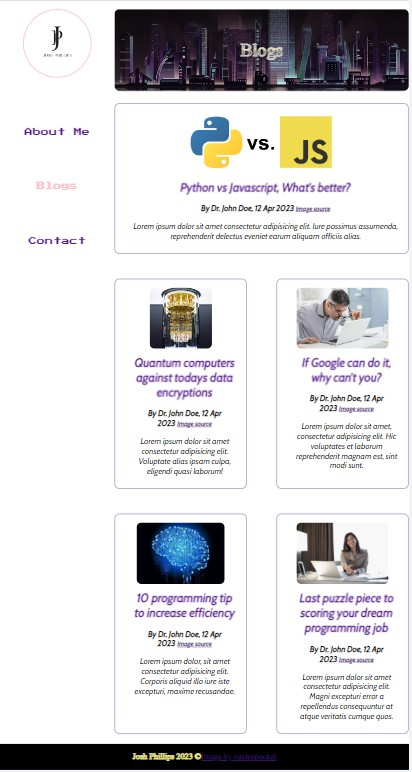

##### Desktop View
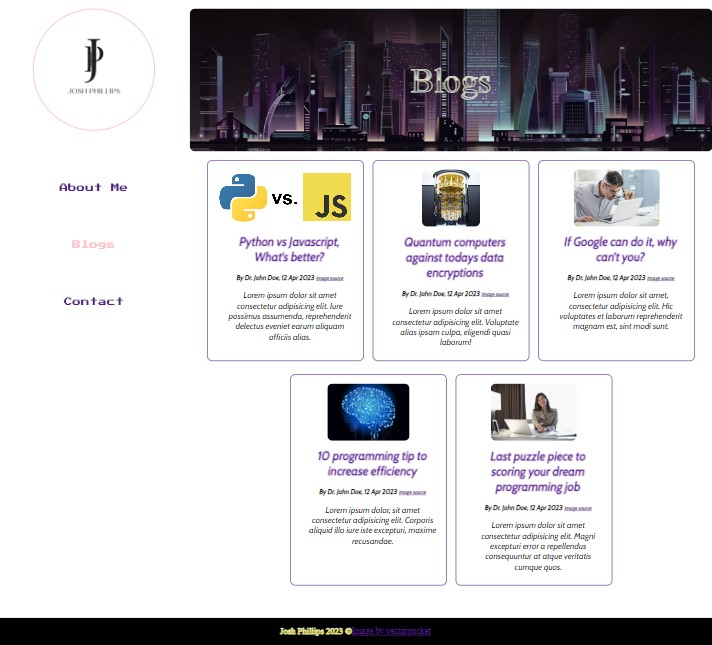

#### Blog Post Wireframes 
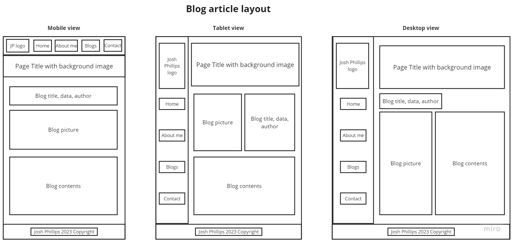

#### Blog Post Screenshots (layout same for all five blog posts)
##### Mobile View
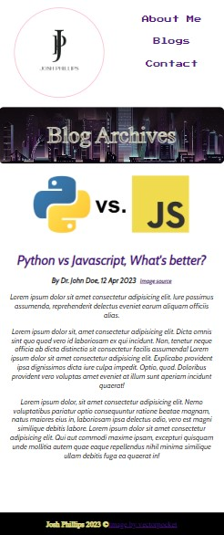

##### Tablet View
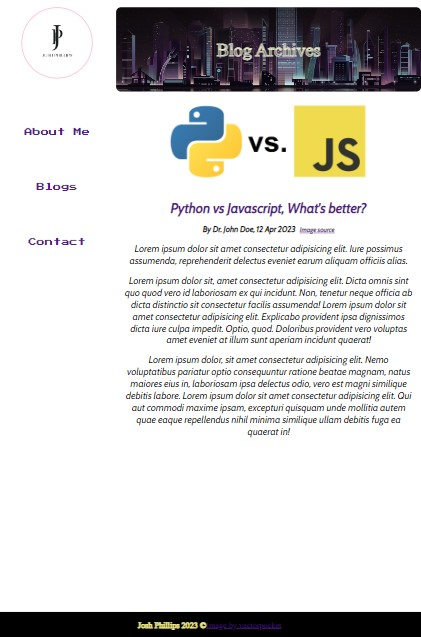

##### Desktop View
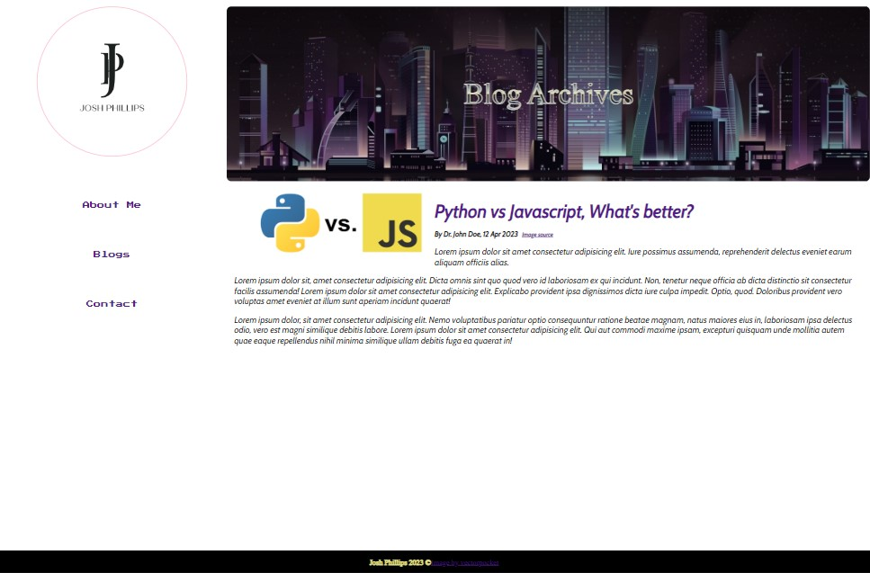

#### Contact Wireframes 
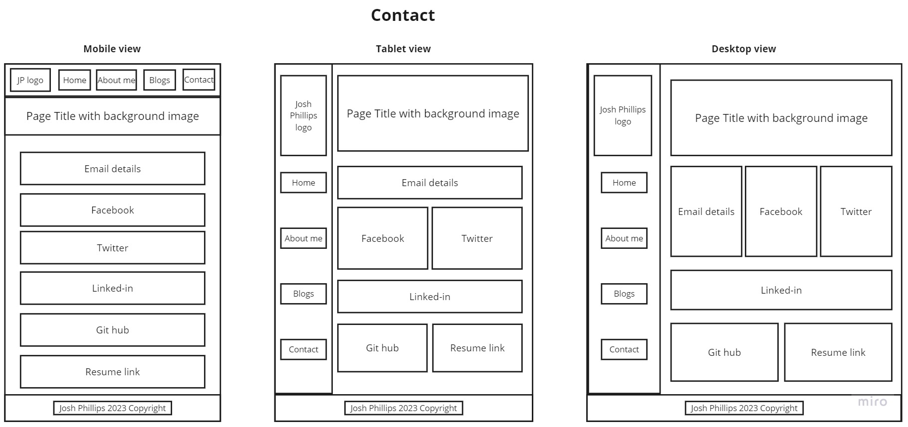

#### Contact Screenshots
##### Mobile View
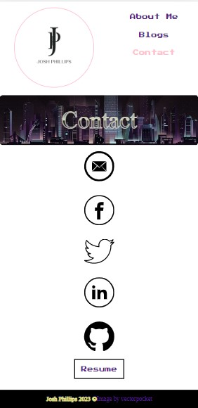

##### Tablet View
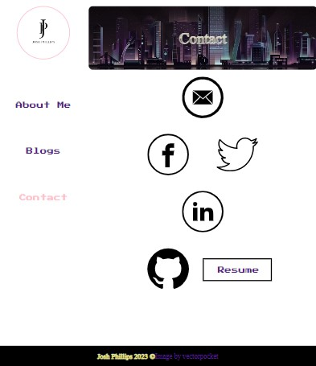

##### Desktop View
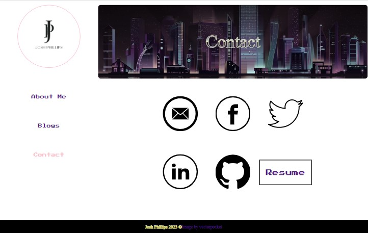

***

### Technology Stack
* Wireframes and Sitemap created with miro.com
* Website developed with HTML and CSS
* Image optimization done by imageoptimizer.net
* Logo created with canva.com
* Website deployed by vercel.com
* Slide deck made with Microsoft Powerpoint
